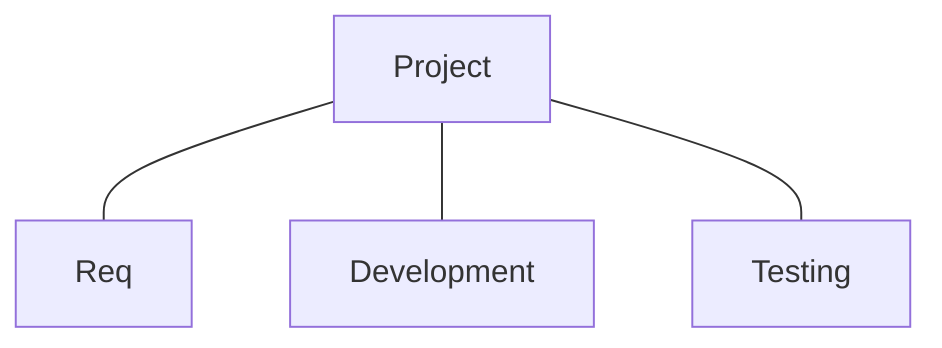

## 9 Management Best Practices from the SPMN*
#### Formal Risk Management
#### Agreement on Interfaces
- User interfaces must be defined before development
- System interfaces must be defined before sw analysis and design
#### Formal Inspections
#### Metric-Based Scheduling and Management
- base cost and schedule estimates on empirical data
- track status through captured metrics
#### Binary quality gates at the inch-pebble level:
- Planning must be based upon an "inch-pebble" detailed activity network
- Objective acceptance criteria must be established
#### Program-wide visibility of progress vs. plan
#### Defect tracking against quality targets
#### Configuration Management
#### People-aware management accountability:
- 90% sw teams outperform 15% teams by factors of 4 or 5 to 1
- Individual productivity ranges of 26:1
- Minimize burn-out
- Avoid excessive overtime
- Provide just-in-time training

---
# SW Planning Activities
1. Identify external constraints:
    - Body count
    - Project inputs and outputs 

2. Identify tasks to be performed 
3. Analyze dependencies among tasks 
4. Estimate the effort, expertise and other resources needed to perform each task 

Assess training and resource needs  
Assign task responsibilities:
- Resource level tasks

Map tasks to a timeline 
Obtain commitment from participants 

---
## Id tasks to be performed
- Tasks to be performed must be id'd based on the life cycle model, the selected dev process, the contract, and the review of schedules from related programs
- Task Id proceeds "top-down" fashion until tasks are id'd that:
    - can be assigned to an individual or group,
    - are small enough that they can be estimated accurately,
    - are precise enough to id interdependencies

### Agile task identification
- Product backlog
- Sprint backlog

 

---
## Analyze Dependencies
### After ID tasks, perform dependency analysis among the tasks:
- Plan, discuss, and brainstorm sequence of events
- Understand external dependencies
### Dependencies can be documented in a PERT chart
- Prog eval and review technique (PERT) was dev by the Navy in the 50's
- Chart is a network:
    - Nodes rep project activities and their associated durations (often calendar weeks or days)
    - Links rep precedence relationships
### Critical path analysis
- What is the minimal time to complete a project?
- What activities are critical to complete the project in min time?
- What activities can be done in parallel?
- How long can each activity be delayed before it affects the finish date

### Crit Path Identification
- The critical path(s) is the path through the PERT chart with no slack time
- Critical paths can be id'd by associating the earliest start and finish time with each node
- Paths where the earliest start time is always equal to the earliest finish time of the preceding node correspond to the critical paths

---
## Assign Task Responsibilities (Agile vs Plan Driven)
- Assign similar tasks to the same person
- Minimize necessary communication
- Match knowledge and skills to the task
- Assign tasks to people so that they learn and grow
- Attempt to accommodate preferences

### Map Tasks to a Timeline
- The schedule must be well thought out and take into account:
    - Constraints:
        - Milestones
        - Note that some constraints may be negotiable
    - Task dependencies
    - Availability of personnel
    - Risks

- Developing a schedule is an iterative process
    - Adjust tasks, durations, resources, and sequencing

- Participants must commit to the schedule

### Agile considerations
- Overall release plan is based on predicted project velocity
- Tasks id'd in sprint planning meeting should specify a person responsible as well as start and end dates

### Gantt Chart
- The schedule can be documented in a Gantt chart.
- Gantt charts id duration of tasks along with their starting and ending dates
    - task duration = work / resources
    - Use historical data from similar projects
    - Document assumptions
- Gantt charts id parallel tasks
- Multiple Gantt charts can be developed to show various levels of detail
    - Hierarchy of Gantt charts
    - Open and close increment Gantt chart for different levels of tasks

### Schedule buffers
- Risk management must be used to guide the team in the amount of contingency time (buffer), which must be allocated to the schedule
- Schedule confidence is tied to the buffer
### Possible ways to shorten crit path
- Negotiate constraints
- Long activities can sometimes be split into shorter and overlapping activities
- Assign more experienced personnel to crit path activities
- If possible, reduce dependencies
### SW Project dev plan
- Intro / Scope
- Controlling docs (contracts and standards)
- Project description (SOW)
- Overall dev plan
- Support Requirements
- Proj Organization
- Dev Standards (typically internal standards)