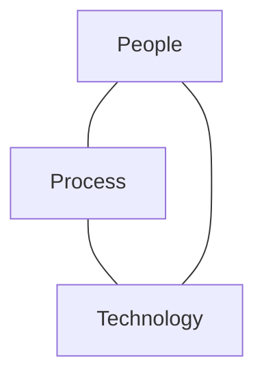

# People Management (soft skills)

## Traditional vs. Agile Roles
- In Traditional projects:
    - A project manager manages the project timeline, resources, and scope in order to meet business requirements
- In "Agile" projects:
    - A **scrum master** is a coach and facilitator and coaches the dev team in executing Agile practices
    - A **program manager** is involved in hiring, firing, budgeting, performance reviews, and mentoring
- Project managers and scrum masters share many common skills

### Make effective Use of your People
- One of the most sig factors of a project's success is the ability experience and motivation of the people involved
- The sw manager must do everything possible to maximize individual and team effectiveness (including their own performance)
    - Basic management skills
    - Team organization
    - Team development
- Teams perform best when the task leader establishes a common vision for the project

### Basic management skills
- Leadership
- Communication
- Delegation
- Negotiation
- Motivation
- Problem solving

## Leadership
- Successful leaders possess and demonstrate the qualities expected of their teams, such as:
    - Tech awareness
    - Dedication
    - The right personal attitudes
    - Motivation skills
    - Team building skills

### What a leader does
- A leader creates a "vision" of a successful project:
    - Set clear goals
        - Believe in the goals
        - Align project goals with team goals
        - Share goals with the team
    - Develop a good plan to meet goals
    - "Believe in the plan"
- A leader guides the team to success:
    - Monitor and control the project
    - Make informed decisions in a timely fashion
        - Use project goals as a basis for decision making

**A leader...**
- Takes responsibility for the project
- Respects team members
- Acts ethically
- Motivates team members
- Provides feedback
- Protects the team from distractions
- Prioritizes activities

### Leadership Qualities
**A leader demonstrates...**
- Genuine concern for team members and their personal growth
- An understanding of human behavior
- Good decision making skills
- A willingness to accept and initiate change
- The desire to continuously learn
- A disciplined work style
- The ability to set objectives and priorities
- Problem solving skills
- The ability to delegate

## Additional management skills
### Communication
- A team leader must have good comm with all team members
    - should understand the effort performed and challenges faced
    - should be approachable
- Both formal and information comm are essential:
    - member status reports
    - meetings
    - leader "walk-arounds"

### Delegation
- Delegate responsibility to others to perform tasks independently
- Both the sw task leader and the person doing the tasks share in responsibility for the tasks
- Successful delegation requires the person performing the task to:
    - Clearly understand what is expected
        - Instill objective completion and quality criteria
    - Possess the authority to perform the task
    - Know how to effectively perform the activity (requires information sharing)
- When delegating a task the sw task leader must encourage the person performing the task to innovate
- When delegating tasks, it is important to:
    - Determine reporting schedule up front
    - Track outcomes against agreed-upon criteria

### Negotiation
- Leading a software dev team often involves **negotiation**
- Negotiation is the process of resolving a conflict in such a way that all stakeholders feel satisfied with the solution
- Effective negotiation requires the application of many skills

### Negotiation Skills
- Observation
    - Listening
    - Observing body language
- The ability to move past blockages
    - Separate the people from the problem
- An understanding of the perspectives and needs of stakeholders
- The ability to focus on the big picture (project vision)
    - Organization and planning skills
- Creativity
    - The ability to find "win-win" solutions
- The ability to sell the solution

### Motivation
***What factors motivate software engineers?***
- Money
- Recognition
- Pride
- Contribution

### Motivation guidelines for leaders
- Learn the needs, goals, and motives of your team
- Provide a work env and task structure that fulfills people's needs
- Implement a fair reward system
    - Recognition, technical advancement, increased technical knowledge and responsibility are important factors as well as salary
- Team members will be motivated to perform if goals, plans, requirements, and expectations are clearly communicated and understood.

### Problem-Solving
- All leaders will face (and will need to solve) problems
- The basic approach to prob-solv is to find the cause of the problem and attempt to eliminate it
    - Not all causes can be eliminated
    - If a cause cannot be eliminated, a work-around must be found so the project can still move forward
- The first step in problem-solving is to understand what the real problem is

### Problem solving steps
- Carefully define the current situation
- Establish the goal
- Determine the gap between the current situation and the goal
- ID the root problem that prevents achieving the goal
    - Do not chase the wrong problems
    - Provider carefully detailed problem description
- Bring together stakeholders
    - Research possible existing solutions
    - Brainstorm new solutions
- Select and implement a solution

## Management Styles
### Theories
Theory X -> autocrat
- View employees...
    - Work primarily for money
    - motivated by fear and insecurity
    - requires close supervision
    - must have detailed procedures to follow

Theory Y -> The manager is a coach
- View employees...
    - need to strive for growth
    - are motivated by achievement, freedom, and self-control
    - do not need or want close supervision
    - are eager to use creativity and take initiative

Theory Z -> facilitator
- Focus is on the relationship of the individual to the organization
- The attributes of an organization using this style include...
    - Lifetime employment, (Committed)
    - Slow evaluation and promotion,
    - Non-specialized career path
    - holistic concerns

Theory W -> negotiator
- This style typically involves striving to id win-win situation by...
    - Understand how people want to win
    -establishing reasonable expectations
    - Matching team members' tasks to their win conditions

## Team Development
- It is important to improve the knowledge and skills of all team members
- Strategies for team dev include:
    - Training
    - Job rotation
    - Mentoring
    - Review, appraisals, and feedback

## Training
- Studies have shown there exists a high correlation between orgs that invest in timely training and project success
- Studies have also shown that a high percentage of sw devs do not keep up with technology changes well enough.
#### Implications
- Just-in-time training
- Continuous improvement of individuals engineers
    - SW leaders should work with team members to develop individual training plans

### Importance of Teamwork
- A successful project requires skilled individuals who work effectively as a team
- Team success is driven by the clear communication of project goals:
    - The team must understand what it is trying to accomplish
    - Individual team members must understand how they contribute to the team's goal

### Characteristics of Good Teams*
- When a team member is struggling, others automatically help out
- Team interactions are "comfortable"
- Conflict is resolved quickly
- team members know each other well and can anticipate reactions to proposed ideas
- Team members are committed to the project
- Team members us "we" rather than "I" when discussing accomplishments and problems
- The team leader is viewed more as a "coach" than a "dictator"
- Team members understand their roles and responsibilities
- The team takes pride in its work
- The team learns from its mistakes
- The team believes that it will be successful

### Team Building Approaches
- Shared experiences
- Shared challenges
- Identity
- Meals/Food (eat together)
- Games/Sports/Events
- Be inclusive (don't alienate a team member)

### Questions to address
- What are our goals?
- What are the team roles and who will fill them?
- What are the responsibilities of these roles?
- How will the team make decisions and settle them?
- What are our quality objectives?
- How will we track performance and what should we do if it falls short?
- What processes should we use to develop the product?
- How do we produce our development plan?
- How do we report status to management and the customer?

